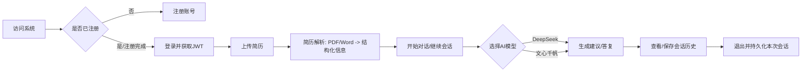
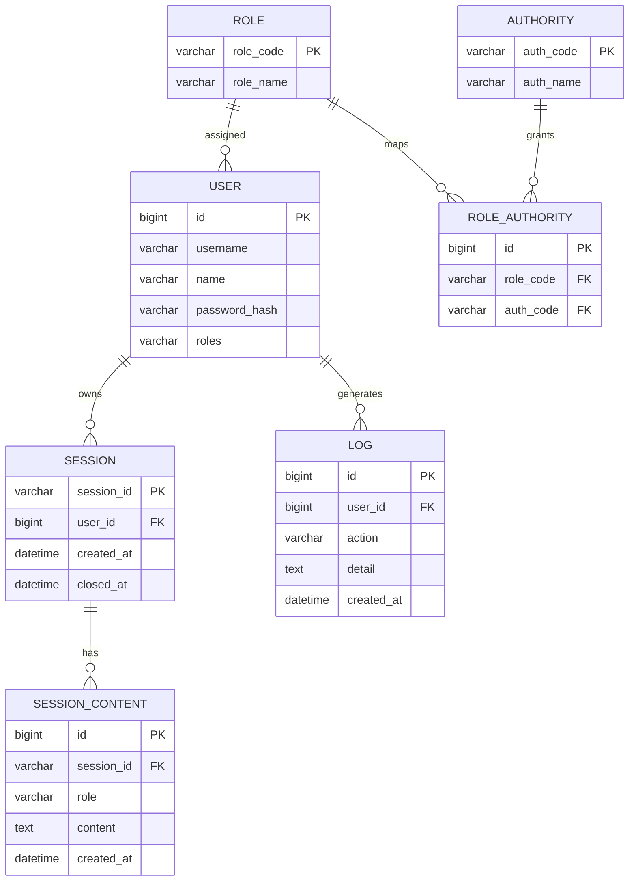
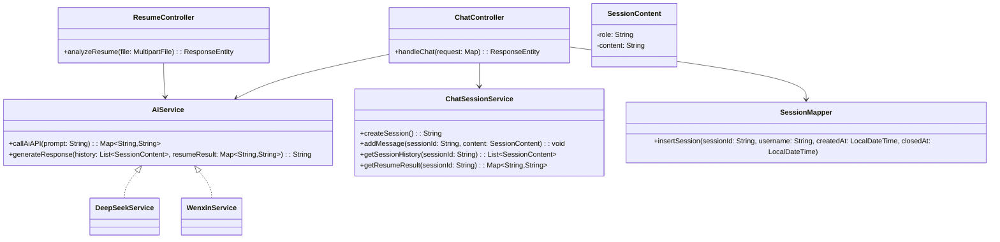
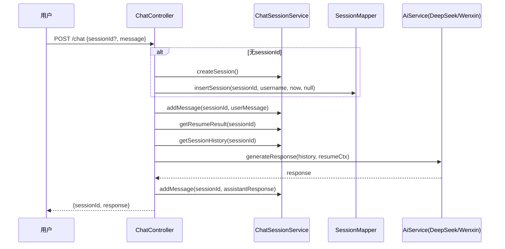

## AIResume 项目报告（Markdown 导出）

### 一、需求分析

- 目标用户
  - 求职者：上传简历，获取结构化信息与面试建议。
  - HR/招聘方：批量解析简历，快速筛选候选人。
  - 管理员：用户与权限管理、AI服务切换、审计日志。

- 核心业务流程


### 二、功能性需求

- 用例图
```mermaid
usecase
  actor 求职者 as JobSeeker
  actor HR as HR
  actor 管理员 as Admin

  JobSeeker -- (注册)
  JobSeeker -- (登录/获取JWT)
  JobSeeker -- (上传简历并解析)
  JobSeeker -- (发起/继续对话)
  JobSeeker -- (查看会话历史)

  HR -- (上传简历并解析)
  HR -- (发起/继续对话)

  Admin -- (用户管理CRUD)
  Admin -- (切换AI服务)
  Admin -- (查看操作日志)
```

- 核心模块与“用户能够…”
  - 用户管理模块：用户能够注册、登录、修改个人信息；管理员能够对用户增删改查并按角色分页检索。
  - 简历分析模块：用户能够上传 PDF/Word 简历并获得结构化结果（技能、教育、工作年限等）。
  - 对话与会话模块：用户能够创建会话、发送消息，结合简历上下文获得个性化建议，查看历史并在退出时落库。
  - 权限与审计模块：系统能够基于 JWT 鉴权与注解式权限控制，记录关键操作审计日志。
  - AI 服务管理模块：管理员能够在 DeepSeek/文心千帆间切换，保障可用性与体验。

### 三、非功能性需求

- 性能需求
  - 登录/切换AI/用户CRUD：响应时间≤200ms（不含外部AI调用）。
  - 对话接口：P95≤1.5s（含大模型延迟）；支持100并发用户，可横向扩展。

- 安全性需求
  - 认证与授权：JWT、基于注解的细粒度权限控制。
  - 数据安全：敏感配置通过环境变量/密钥服务注入；密码BCrypt哈希；日志脱敏。
  - 输入校验：防SQL注入（参数绑定）、上传类型与大小校验（≤5MB）。

- 可用性需求
  - 界面简洁、路径清晰、错误信息统一；关键步骤有提示与日志。

- 兼容性需求
  - 前端：现代浏览器（Chrome/Edge）。
  - 后端：Windows/Linux，JDK 17，MySQL 8.x。

### 四、系统设计

#### 4.1 总体架构设计与技术选型

- 后端：Java 17、Spring Boot 3.5.5、Spring MVC、Spring Data JPA + MyBatis、WebFlux（外部HTTP）、Lombok
- 文档处理：Apache PDFBox、Apache POI
- 数据库：MySQL 8.0.33
- 安全：JJWT（JWT 生成与校验）
- 开发工具：IntelliJ IDEA、Maven、Git
- 选型理由：
  - Spring Boot 生态成熟，开发效率高；JPA + MyBatis 兼顾通用持久化与定制 SQL 性能。
  - PDFBox/POI 解析主流简历格式；JJWT 简化认证实现。
  - 通过 `AiService` 抽象实现可插拔多模型，有效降低厂商锁定风险。

- 系统架构图
```mermaid
graph TD
  FE[前端静态页 HTML/CSS/JS] -->|HTTP/JSON+JWT| BE[Spring Boot 应用]
  subgraph 后端
    BE --> Ctrl[Controller 层]
    Ctrl --> Svc[Service 层]
    Svc --> Repo[Repository/JPA]
    Svc --> Mapper[MyBatis Mapper]
    Svc --> Utils[Utils (JWT, File)]
    Svc --> AI[外部AI: DeepSeek/文心]
  end
  Repo --> DB[(MySQL)]
  Mapper --> DB
  Utils --> Store[文件/配置]
```

#### 4.2 功能模块设计

```mermaid
graph TD
  A[用户管理] --> A1[注册/登录/JWT]
  A --> A2[用户CRUD/分页/角色]
  B[简历分析] --> B1[PDF/Word解析]
  B --> B2[结构化抽取]
  C[对话会话] --> C1[创建/继续会话]
  C --> C2[上下文拼接/回复生成]
  D[权限审计] --> D1[@RequirePermission]
  D --> D2[日志写入]
  E[AI服务管理] --> E1[模型切换]
```

### 五、数据库设计

- 概念模型（ER 图）


- 表清单（主要）
  - `users`：用户基本信息与登录凭据
  - `sessions`：会话主表
  - `session_contents`：会话消息明细
  - `logs`：审计日志
  - `authorities`：权限点
  - `role_authorities`：角色-权限映射

- 逻辑模型（关键表结构）

| 表名 | 字段 | 类型 | 约束 | 说明 |
|---|---|---|---|---|
| users | id | bigint | PK |  |
|  | username | varchar(50) | unique, not null | 登录名 |
|  | name | varchar(50) |  | 显示名 |
|  | password_hash | varchar(255) | not null | BCrypt |
|  | roles | varchar(100) | not null | 逗号分隔或多行表（本项目为简化） |
|  | created_at | datetime |  |  |
| sessions | session_id | varchar(64) | PK | UUID |
|  | user_id | bigint | FK->users.id |  |
|  | created_at | datetime |  |  |
|  | closed_at | datetime |  |  |
| session_contents | id | bigint | PK | 自增 |
|  | session_id | varchar(64) | FK->sessions.session_id |  |
|  | role | varchar(20) |  | user/assistant |
|  | content | text |  |  |
|  | created_at | datetime |  |  |
| logs | id | bigint | PK | 自增 |
|  | user_id | bigint | FK->users.id |  |
|  | action | varchar(100) |  |  |
|  | detail | text |  |  |
|  | created_at | datetime |  |  |
| role_authorities | id | bigint | PK |  |
|  | role_code | varchar(50) | FK->roles.role_code |  |
|  | auth_code | varchar(50) | FK->authorities.auth_code |  |

- 关键表详述（示例：`session_contents`）

| 字段名 | 类型 | 约束 | 注释 |
|---|---|---|---|
| id | bigint | PK, auto_increment | 主键 |
| session_id | varchar(64) | not null, FK | 关联会话 |
| role | varchar(20) | not null | user/assistant |
| content | text | not null | 消息内容 |
| created_at | datetime | not null | 创建时间 |

### 六、详细设计（可选加分）

- 核心类图


- 核心流程时序图（对话）


### 七、系统实现与核心代码

- 开发环境
  - OS：Windows 10/11 或 Linux
  - JDK：17
  - DB：MySQL 8.0.33
  - 构建：Maven
  - 启动：`mvn spring-boot:run` 或运行 `AiResumeApplication` 主类

- 关键功能实现与代码展示

1) 对话与模型切换（可插拔 AI）

```java
// src/main/java/com/airesume/controller/ChatController.java（节选）
@PostMapping("/chat")
public ResponseEntity<?> handleChat(@RequestBody Map<String, String> request) {
    String sessionId = request.get("sessionId");
    String message = request.get("message");
    if (sessionId == null || sessionId.isEmpty()) {
        sessionId = chatSessionService.createSession();
        sessionMapper.insertSession(sessionId, TokenContext.getCurrentUserName(), LocalDateTime.now(), null);
    }
    chatSessionService.addMessage(sessionId, new SessionContent("user", message));
    Map<String, String> resumeResult = chatSessionService.getResumeResult(sessionId);
    List<SessionContent> history = chatSessionService.getSessionHistory(sessionId);
    String aiService = System.getProperty("ai.service", "deepseek");
    String response = "wenxin".equalsIgnoreCase(aiService)
        ? wenxinService.generateResponse(history, resumeResult)
        : deepSeekService.generateResponse(history, resumeResult);
    chatSessionService.addMessage(sessionId, new SessionContent("assistant", response));
    Map<String, Object> result = new HashMap<>();
    result.put("sessionId", sessionId);
    result.put("response", response);
    return ResponseEntity.ok(result);
}
```

2) 简历分析接口与权限控制（声明式权限注解）

```java
// src/main/java/com/airesume/controller/ResumeController.java（节选）
@RequirePermission({"ROLE_ADMIN", "ROLE_ROOT"})
@PostMapping("/analyze")
public ResponseEntity<?> analyzeResume(@RequestParam("resume") MultipartFile file) {
    Map<String, Object> result = resumeService.analyzeResume(file);
    return ResponseEntity.ok(result);
}
```

3) 运行时切换 AI 服务（运维友好）

```java
// src/main/java/com/airesume/controller/AIController.java（节选）
@PostMapping("/set-ai-service")
public ResponseEntity<?> setAIService(@RequestBody Map<String, String> request) {
    String service = request.get("service");
    if ("deepseek".equals(service) || "wenxin".equals(service)) {
        System.setProperty("ai.service", service);
        return ResponseEntity.ok("AI服务已切换为: " + service);
    }
    return ResponseEntity.badRequest().body("无效的AI服务");
}
```

4) 权限注解定义

```java
// src/main/java/com/airesume/annotation/RequirePermission.java
@Target(ElementType.METHOD)
@Retention(RetentionPolicy.RUNTIME)
public @interface RequirePermission {
    String[] value();
}
```

- 效果截图（占位说明）
  - 登录后调用 `/chat` 返回个性化建议的页面截图
  - 上传简历并展示解析结构的页面截图
  - 切换 AI 服务后的对话响应对比截图

### 八、系统测试

- 测试策略
  - 单元测试：Service 层（用户、简历、AI 服务 Mock）。
  - 集成测试：认证/权限、文件上传解析、会话与对话流程。
  - 功能测试：基于接口文档逐一验证。

- 测试环境
  - JDK 17、MySQL 8.0、Spring Boot 3.5.5，本地与测试环境配置分离。

- 测试用例与结果（示例）

| 用例ID | 场景 | 输入 | 预期结果 | 实际结果 | 通过 |
|---|---|---|---|---|---|
| TC-LOGIN-001 | 用户登录 | 正确用户名密码 | 返回JWT | 返回JWT | 是 |
| TC-CHAT-001 | 新建会话并对话 | 无sessionId+message | 返回新sessionId与回复 | 一致 | 是 |
| TC-AI-SET-001 | 切换AI服务 | service=wenxin | 返回成功消息 | 一致 | 是 |
| TC-ANALYZE-403 | 无权限解析 | 角色=ROLE_USER | 403 Forbidden | 一致 | 是 |
| TC-UPLOAD-VAL | 非法文件上传 | 大于5MB/非PDF/Word | 400/错误提示 | 一致 | 是 |

- 测试总结
  - 认证、权限、上传解析、对话链路稳定；外部 AI 延迟为主要瓶颈，建议启用超时/重试与降级；扩展更多边界用例可进一步提升健壮性。

---

文档版本：v1.0  |  代码入口：`com.airesume.AiResumeApplication`  |  参考文档：`arch.md`、`API.md`


