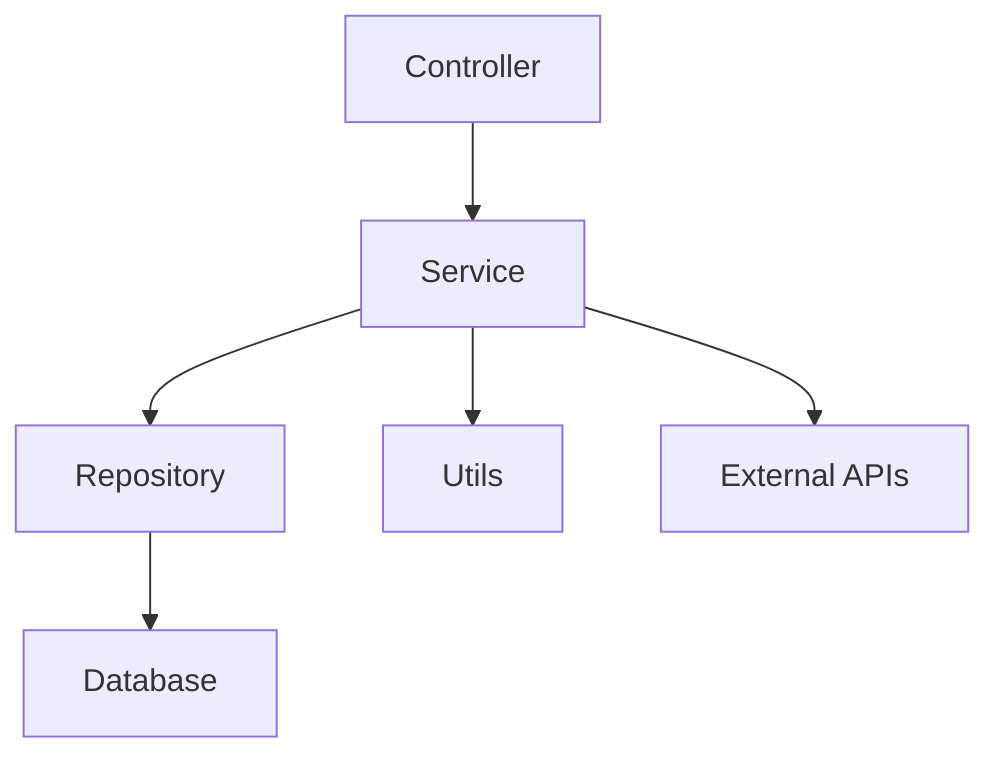

# AIResume 项目架构文档

## 1. 项目概述
AIResume 是一个基于 Spring Boot 的 Java Web 项目，主要用于简历解析和 AI 辅助生成。项目采用分层架构设计，包括控制器层、服务层、数据访问层和工具类等模块。

## 2. 技术栈
- **核心框架**: Spring Boot 3.5.5
- **数据库**: MySQL 8.0.33
- **持久层**: Spring Data JPA
- **Web 层**: Spring Web MVC
- **工具类**: Lombok, JWT, OkHttp, Gson
- **文件解析**: Apache PDFBox, Apache POI

## 3. 模块划分
### 3.1 控制器层 (Controller)
- `AIController`: 处理 AI 相关请求
- `ChatController`: 处理聊天功能
- `LoginController`: 处理用户登录
- `ResumeController`: 处理简历解析
- `UserController`: 处理用户管理

### 3.2 服务层 (Service)
- `ChatSessionService`: 管理聊天会话
- `DeepSeekService`: 集成 DeepSeek AI
- `LogService`: 日志记录
- `ResumeService`: 简历解析逻辑
- `UserService`: 用户管理逻辑
- `WenxinService`: 集成文心一言

### 3.3 数据访问层 (Repository)
- `LogRepository`: 日志数据访问
- `UserRepository`: 用户数据访问

### 3.4 工具类 (Utils)
- `FileUtils`: 文件操作工具
- `JwtUtils`: JWT 工具
- `TokenContext`: 令牌上下文管理

## 4. 依赖关系
- 项目依赖 Spring Boot Starter 系列库，包括 Web、Data JPA、Test 等。
- 外部依赖包括 MySQL 驱动、JWT、OkHttp、Gson、PDFBox 和 POI。

## 5. 架构图

## 6. 后续优化建议
- 引入缓存机制（如 Redis）提升性能。
- 增加单元测试覆盖率。
- 优化文件解析逻辑，支持更多格式。

## 7. 相关文档
- 接口文档：参见 `API.md`